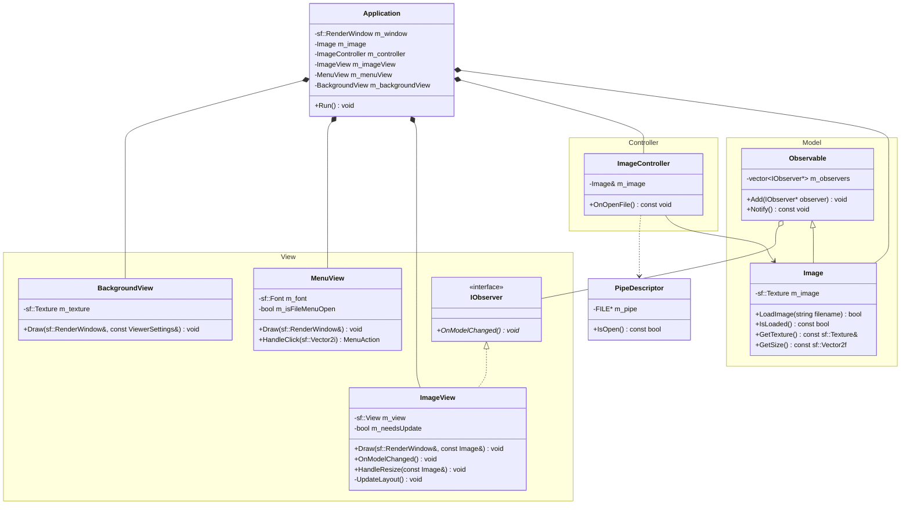

```mermaid
classDiagram
    namespace Model {
        class Observable {
            -vector~IObserver*~ m_observers
            +Add(IObserver* observer) void
            +Notify() const void
        }
        class Image {
            -sf::Texture m_image
            +LoadImage(string filename) bool
            +IsLoaded() const bool
            +GetTexture() const sf::Texture&
            +GetSize() const sf::Vector2f
        }
    }

    namespace View {
        class IObserver {
            <<interface>>
            +OnModelChanged()* void
        }
        class ImageView {
            -sf::View m_view
            -bool m_needsUpdate
            +Draw(sf::RenderWindow&, const Image&) void
            +OnModelChanged() void
            +HandleResize(const Image&) void
            -UpdateLayout() void
        }
        class MenuView {
            -sf::Font m_font
            -bool m_isFileMenuOpen
            +Draw(sf::RenderWindow&) void
            +HandleClick(sf::Vector2i) MenuAction
        }
        class BackgroundView {
            -sf::Texture m_texture
            +Draw(sf::RenderWindow&, const ViewerSettings&) void
        }
    }

    namespace Controller {
        class ImageController {
            -Image& m_image
            +OnOpenFile() const void
        }
    }

    class Application {
        -sf::RenderWindow m_window
        -Image m_image
        -ImageController m_controller
        -ImageView m_imageView
        -MenuView m_menuView
        -BackgroundView m_backgroundView
        +Run() void
    }

    class PipeDescriptor {
        -FILE* m_pipe
        +IsOpen() const bool
    }

    
    Observable <|-- Image
    IObserver <|.. ImageView

    Observable o-- IObserver

    ImageController --> Image
    ImageController ..> PipeDescriptor

    Application *-- Image
    Application *-- ImageController
    Application *-- ImageView
    Application *-- MenuView
    Application *-- BackgroundView
```